# Lab 2- Audit Azure Linux Architecture and Package Security

## Scenario

Northwind Retail successfully deployed its storefront application in Lab
1.

Before the server can be approved for a banking workload, the security
team requires a compliance review of the Azure Linux environment.

Your role is to audit the server and document findings that could affect
security, maintenance, and compliance.

## Objective

In this lab, students perform a basic security and compliance review of
the Azure Linux storefront server created in Lab 1.

Students will:

- Review installed software packages.

- Identify unmanaged software.

- Check for pending updates.

- Verify package repository trust settings.

- Review listening ports and running services.

- Evaluate the system's security posture.

- Produce a security audit report.

## Task 1: Reconnect to the Azure Linux VM

1.  Update below command with Azure Linux VM( created in Lab1) and run
    it if you don’t have VS Code instance open.

+++ssh -i ~/Downloads/vmKey.pem azureuser@\<PUBLIC_IP\>+++

## Task 2: Review Installed Software Packages

One of the first tasks during a security review is identifying what
software is installed.

A smaller software footprint generally means:

- Lower attack surface

- Fewer vulnerabilities

- Easier patch management

1.  Run below command to count installed packages. Record the package
    count.

+++tdnf list installed | wc -l+++

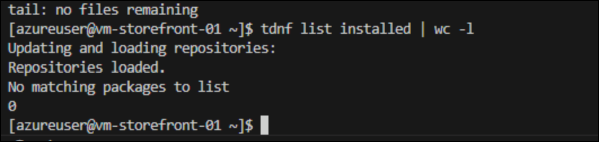

2.  Generate Software Inventory

> +++rpm -qa \> /tmp/installed-packages.txt+++
>
> 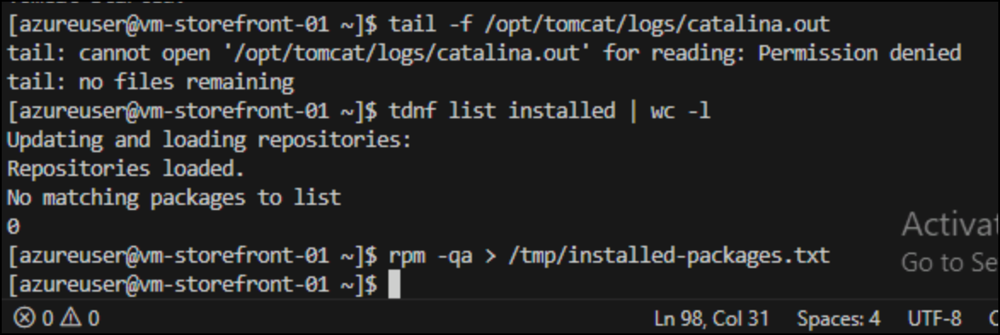

3.  Run below command to verify Tomcat is not package managed.

+++rpm -qa | grep -i tomcat+++

> 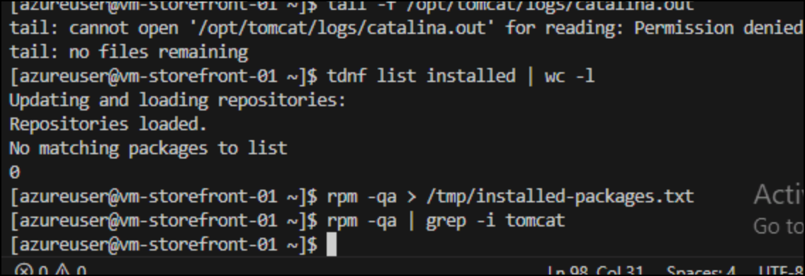

4.  Run below command to verify Tomcat exist

+++sudo ls /opt/tomcat/bin/catalina.sh+++

> 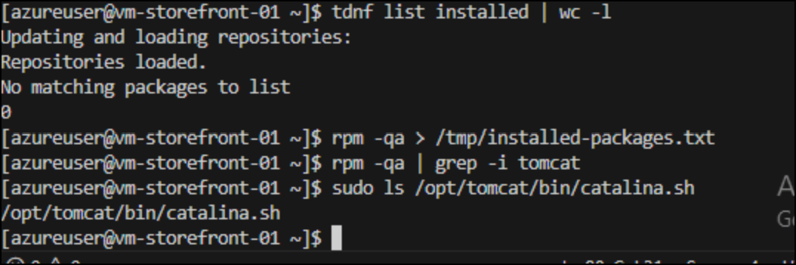
>
> **Audit Finding**
>
> Apache Tomcat is installed on the server but does not appear in the
> package inventory because it was installed manually from a tarball
> rather than through the Azure Linux package manager.
>
> This is a real-world compliance gap because:

- Automatic patch scans may miss it.

- Vulnerability tools may not detect it.

- Updates must be manually managed.

## Task 3: Check for Pending Updates

One of the first tasks in a security review is determining whether the
server has pending software updates.

Unpatched software can expose systems to known vulnerabilities. Auditors
commonly review:

- Missing updates

- Patch status

- Potential vulnerability exposure

1.  **Run below command to check for Updates**

+++sudo tdnf check-update+++

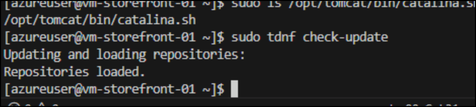

2.  Run below command to list updates

+++sudo tdnf list updates+++

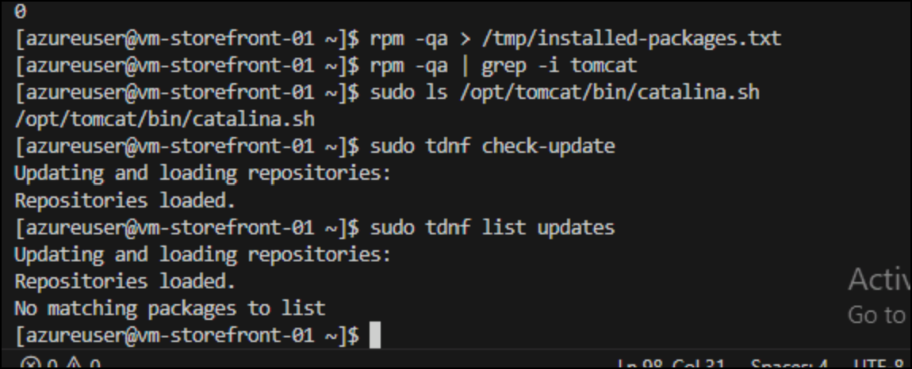

3.  Record number of available updates if any.This is a finding, not
    automatically a security issue. System appears fully patched based
    on currently configured repositories in this lab.

## Task 4: Verify Repository Trust and Package Authenticity

Package managers should only install software from trusted repositories.

Repository verification helps ensure software packages have not been
tampered with before installation.

1.  Run below command to list configured repositories

+++tdnf repolist+++

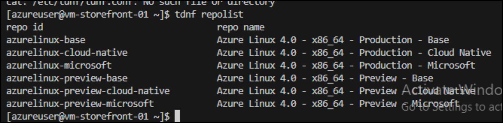

**Audit Finding**

During validation, /etc/tdnf/tdnf.conf was not present on the Azure
Linux 4 image. Document repository configuration using tdnf repolist
instead of relying on the configuration file.

## Task 5: Review Network Exposure and Running Services

Security teams need to understand:

- Which services are running

- Which ports are open

- Whether unnecessary services are exposed externally

1.  Run below command to review listening ports. Identify listening
    ports.

+++sudo ss -tulpn+++

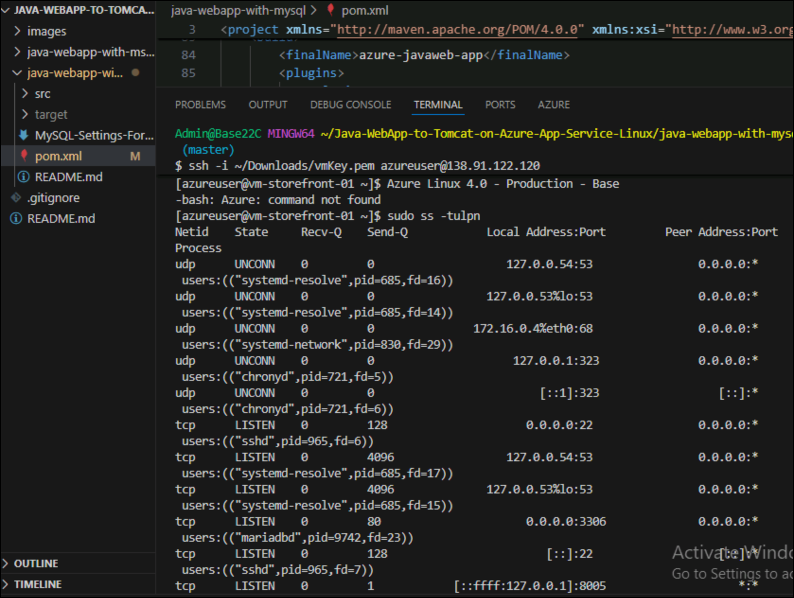

2.  **Run below command to review running services**

+++systemctl list-units --type=service --state=running+++

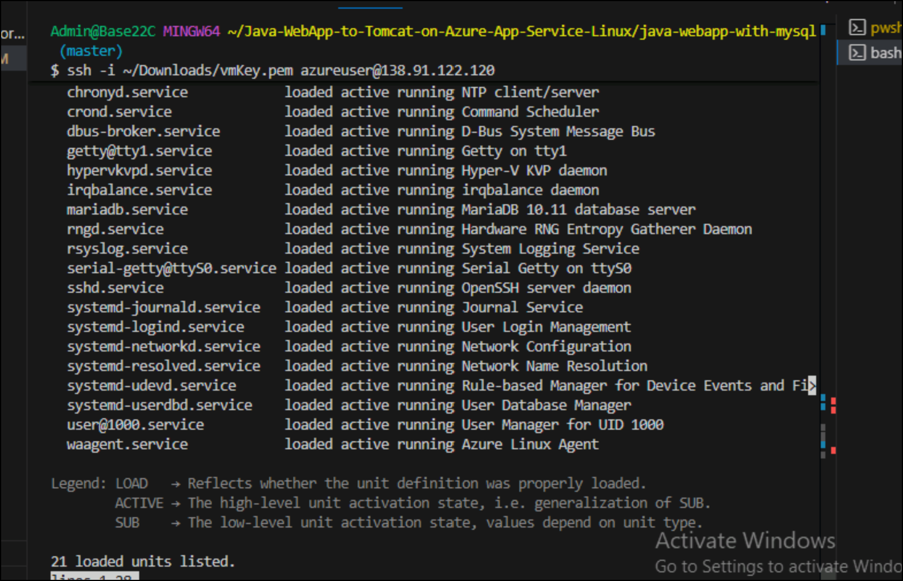

3.  Review the output. Is MariaDB listening on. Record a security
    finding because the database is externally accessible.

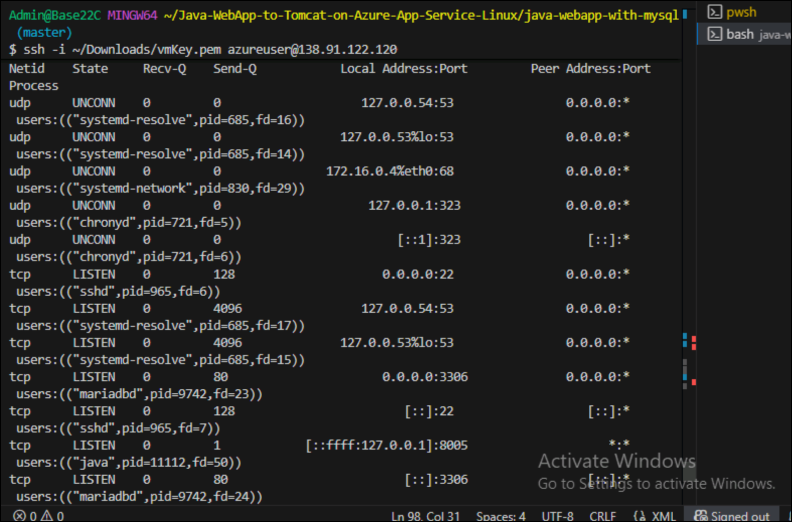

## Task 6: Review SELinux Posture

SELinux provides mandatory access controls that help limit what
processes can access.

1.  Run below command to check SELinux status

+++getenforce+++

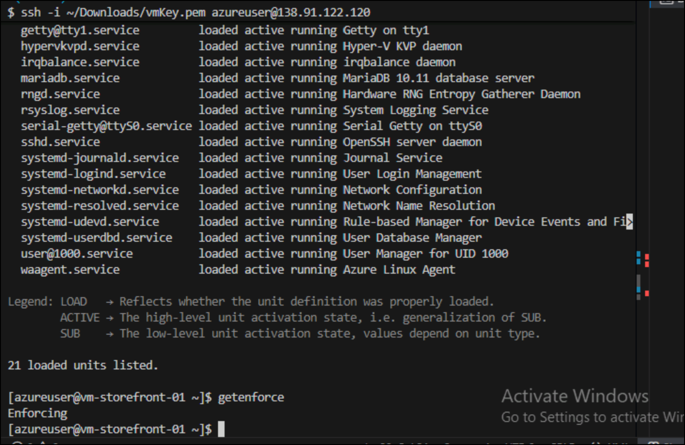

\> \[!hint\] If command fails:

getenforce: command not found

record that as an audit finding.

**Alternative**

sestatus

(if available)

## Summary

In this lab, you performed a security and compliance review of the Azure
Linux storefront server deployed in Lab 1. You reviewed installed
software, evaluated patch status, verified trusted repositories,
inspected network exposure, reviewed running services, and analyzed the
system's security posture.

The most significant finding was that Apache Tomcat was installed
manually and does not appear in the package inventory. Additionally,
MariaDB was found listening on port 3306 externally, which would likely
require remediation before approval for a banking workload.

By completing this lab, you learned how security teams and system
administrators assess Azure Linux environments, identify compliance
gaps, and document findings before production workloads are approved.
