# Lab 3 – Implement Centralized Monitoring for Azure Linux VMs

## Scenario

Northwind Healthcare operates patient-facing applications that must
satisfy regulatory auditing requirements.

Security and operations teams must prove that:

Application logs are centrally collected

Application logs are searchable

Application logs are retained

Application incidents can be investigated

The storefront VM deployed in Lab 1 will now represent a healthcare
application server.

The VM must be onboarded into Azure Monitor and Log Analytics.

## Objective

In this lab, students implement centralized monitoring for the Azure
Linux storefront VM built in Lab 1 and audited in Lab 2.

Students will:

- Configure Azure Monitor integration.

- Connect an Azure Linux VM to Log Analytics.

- Verify Azure Monitor Agent installation.

- Generate log activity on Azure Linux.

- Validate log collection using KQL.

- Demonstrate centralized operational visibility.

## Task 1: Create a Log Analytics Workspace

Log Analytics provides centralized storage and querying for collected
logs.

Without centralization:

Logs remain on the individual VM

With Log Analytics:

1.  Open VS code new instance and run +++az login+++ and sign in with
    cloud slice account

> 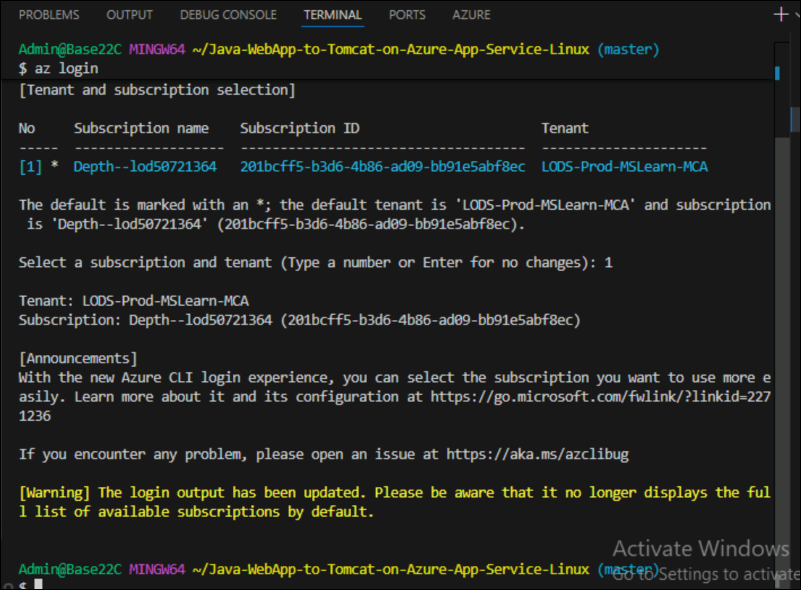

2.  Run below command to create workspace

> +++az monitor log-analytics workspace create --resource-group
> ResourceGroup1 --workspace-name law-northwind-storefront --location
> eastus+++

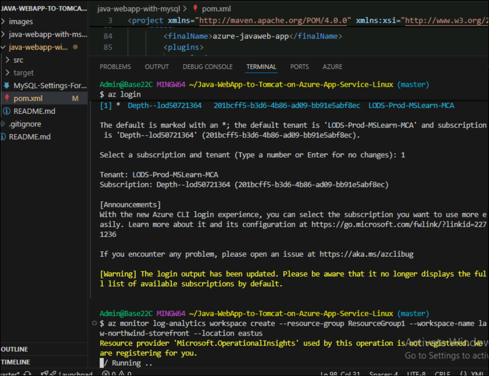

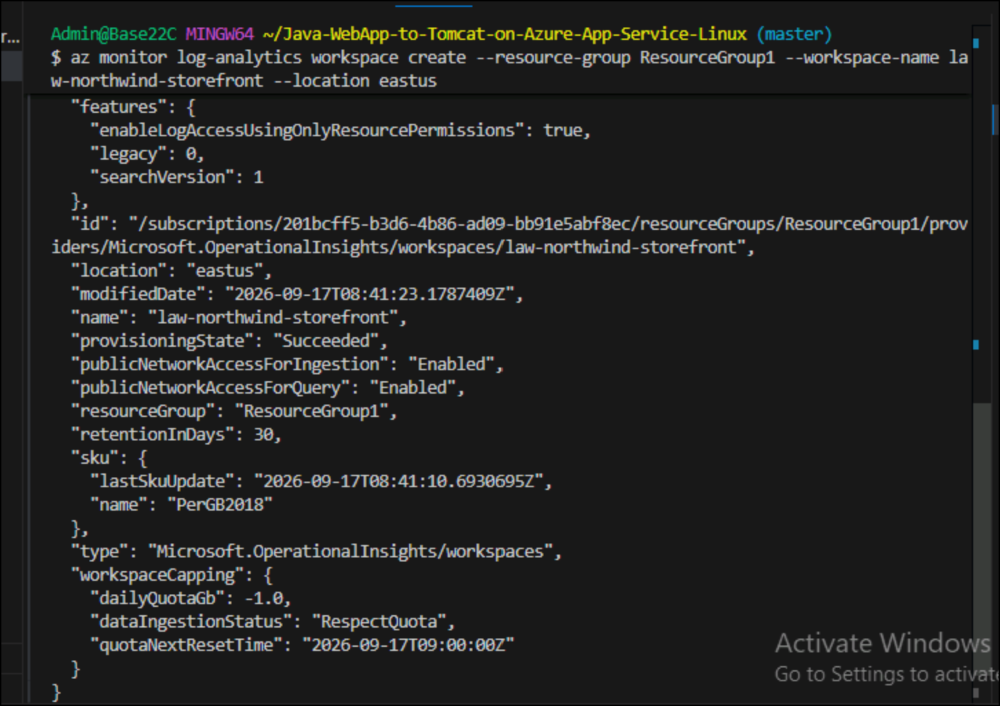

## Task 2: Connect the Azure Linux VM to Azure Monitor

The Azure Monitor Agent (AMA) collects telemetry from Azure Linux and
forwards it to Log Analytics.

1.  Open a browser and navigate to the Azure Linux VM - vm-storefront-01

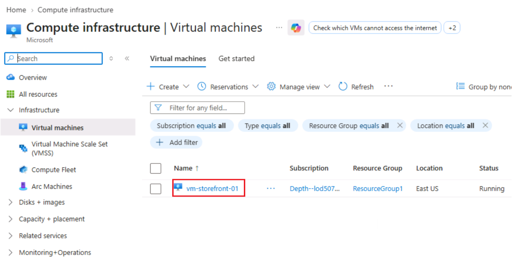

2.  Click on **Monitoring -\>Insights** from left navigation menu.

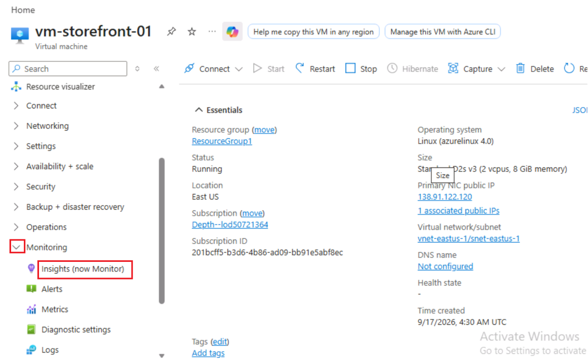

3.  Switch back to VS code and run below command to install Azure
    monitor agent.

> +++az vm extension set --resource-group ResourceGroup1 --vm-name
> vm-storefront-01 --publisher Microsoft.Azure.Monitor --name
> AzureMonitorLinuxAgent+++

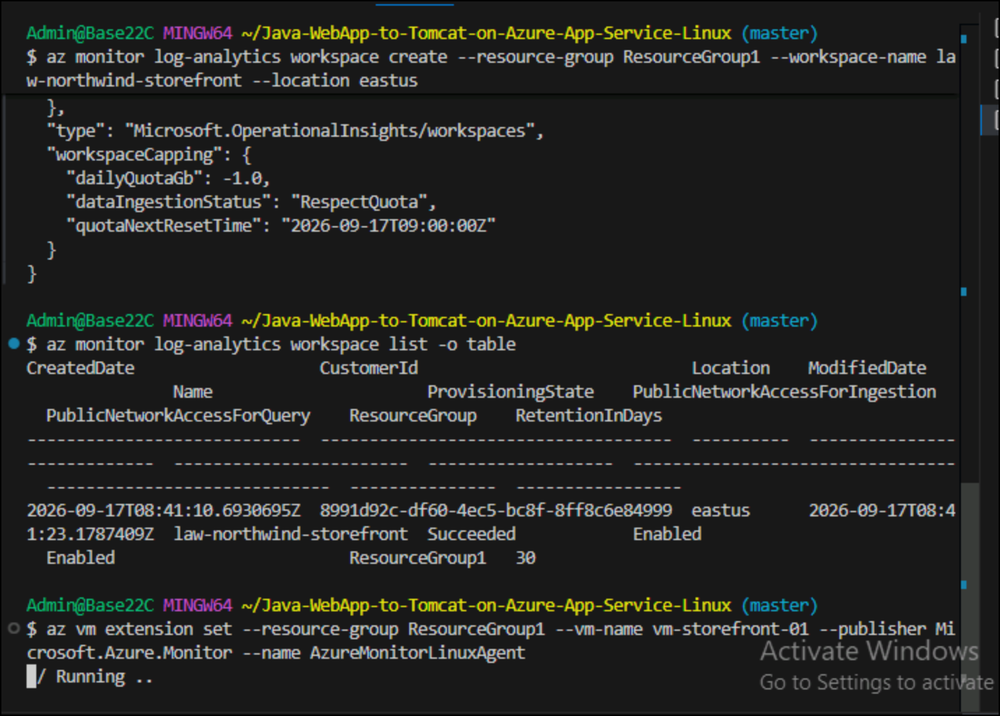

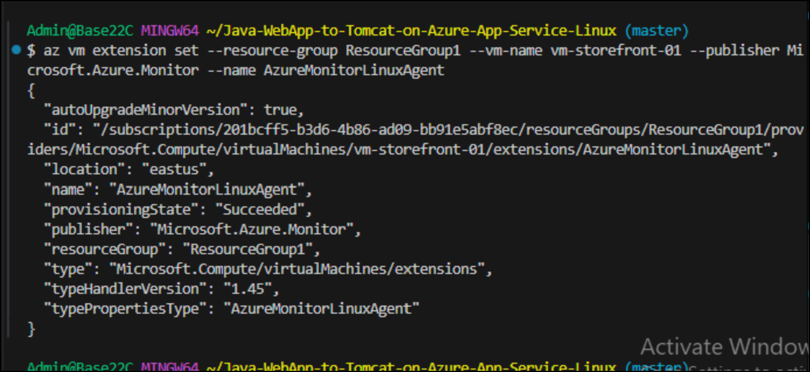

4.  Run below command to verify installation.

> +++az vm extension list --resource-group ResourceGroup1 --vm-name
> vm-storefront-01 -o table+++

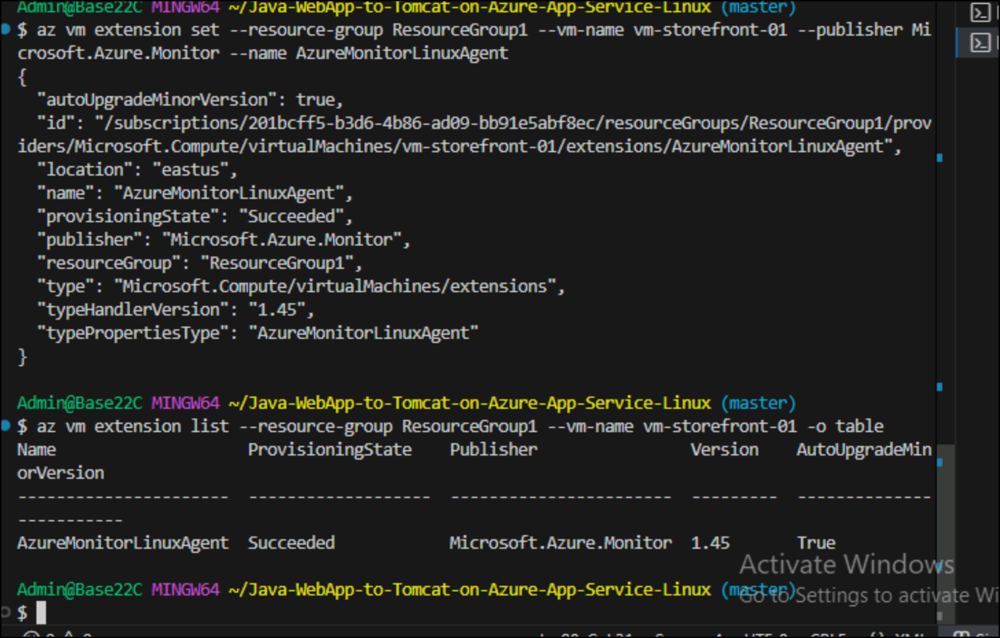

## Task 3: Verify Existing Storefront Services

Before monitoring, confirm the workload deployed in Lab 1 is still
operational.

**1.**Run below command to connect to Azure Linux

+++chmod 400 ~/Downloads/vmKey.pem+++

**+++**ssh -i ~/Downloads/vmKey.pem azureuser@\<PUBLIC_IP\>+++

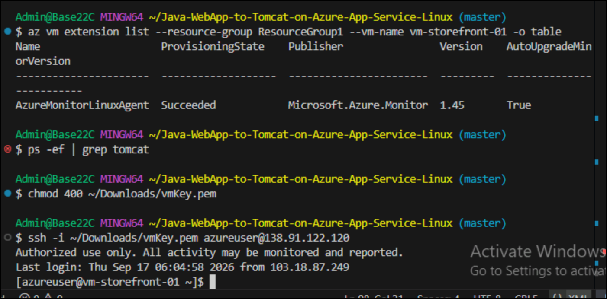

2.  Run below command to verify Tomcat

+++ps -ef | grep tomcat+++

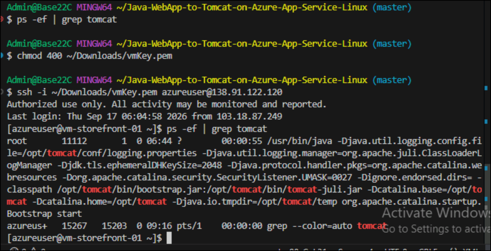

## Task 4: Generate Azure Linux Log Activity

Monitoring requires log activity before it can be collected.

**1.** Run below command to generate a test log entry.SSH to the Azure
Linux VM and run:

+++logger "NORTHWIND-TEST: healthcare monitoring checkpoint $(date)"+++

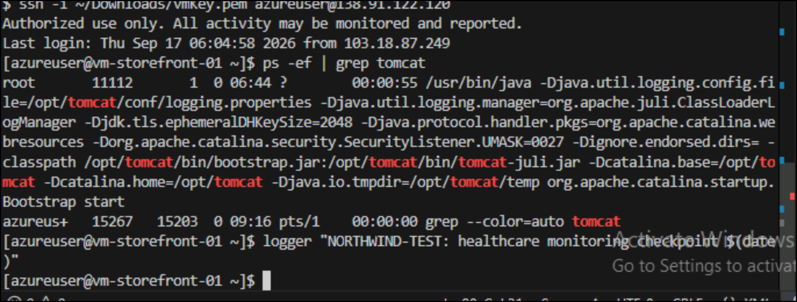

3.  Run below command to verify local log collection

> +++journalctl -n 10+++

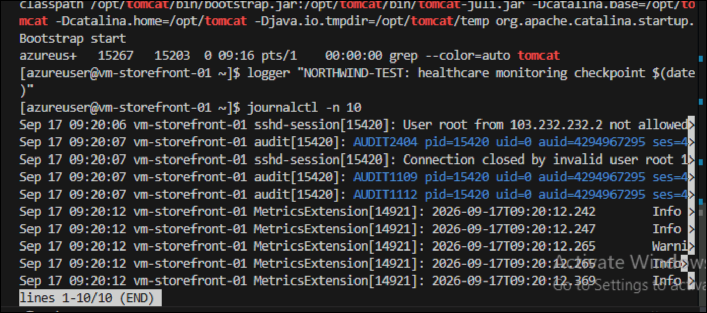

## Task 5: Verify Centralized Log Collection

1.  Switch back to Azure portal and open resource group and select Log
    Analytics Workspace

> 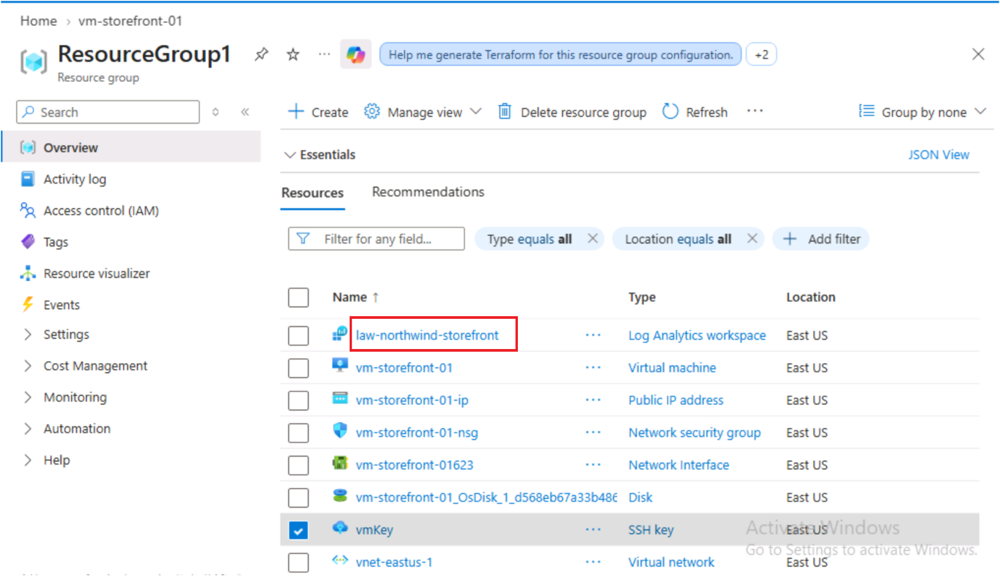

2.  Click on Logs from left navigation.

> 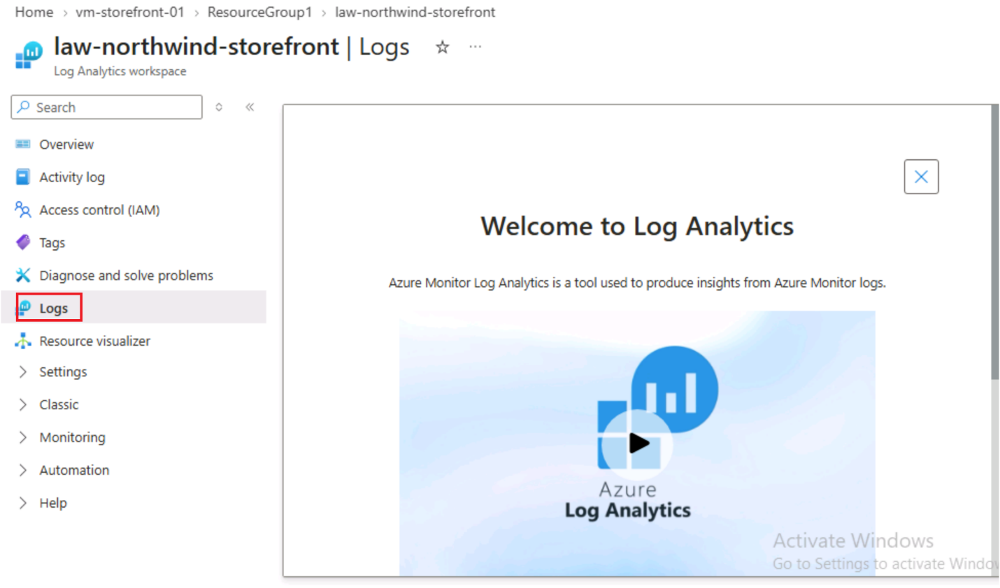

## Task 6: Investigate Storefront Service Logs

1.  Review SSH Activity

+++journalctl -u sshd -n 20+++

> 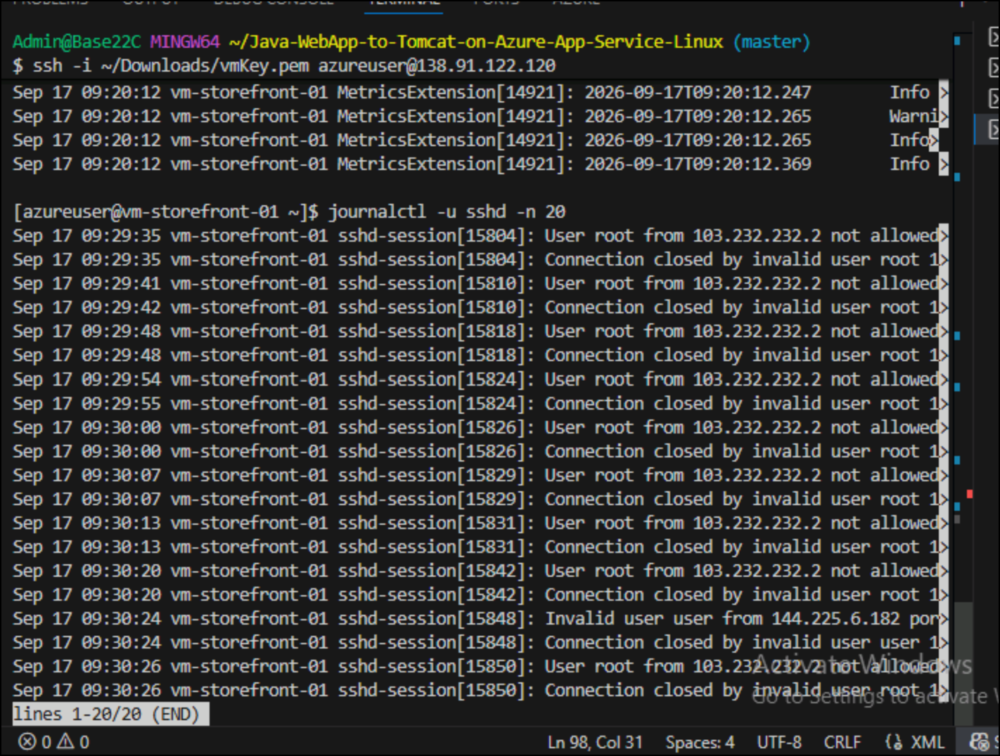

## Summary

In this lab, you implemented centralized monitoring for an Azure Linux
virtual machine by creating a Log Analytics workspace, installing and
verifying the Azure Monitor Agent, generating test log activity, and
reviewing collected logs. You also validated application and SSH service
activity, demonstrating how Azure Monitor and Log Analytics provide
centralized visibility, auditing, and operational monitoring for Linux
workloads in a healthcare environment.
