## Scenario

Northwind Government Agency manages Azure Linux virtual machines that
support citizen-service applications.

Government regulations require administrators to establish governance
standards that ensure:

- Resource ownership can be identified.

- Workloads are deployed only in approved regions.

- Compliance requirements can be audited continuously.

- Azure resources adhere to organizational policies.

As a cloud administrator, you must review Azure Policy definitions,
analyze compliance reports, and understand how Azure Policy helps
enforce governance requirements across Azure Linux resources.

## Objectives

After completing this lab, you will be able to:

- Explore Azure Policy definitions.

- Analyze policy assignments.

- Review Azure Policy compliance reports.

- Understand governance and compliance controls.

- Implement resource tagging strategies.

- Interpret compliance evaluation results.

## Exercise 1: Deploy an Azure Linux VM and assign compliance policies

### Task 1: Create Azure Linux VM

1.  Open browser and go to +++<https://portal.azure.com>+++ and sign in
    with your Azure credentials.

2.  Click on Cloud Shell and select Bash

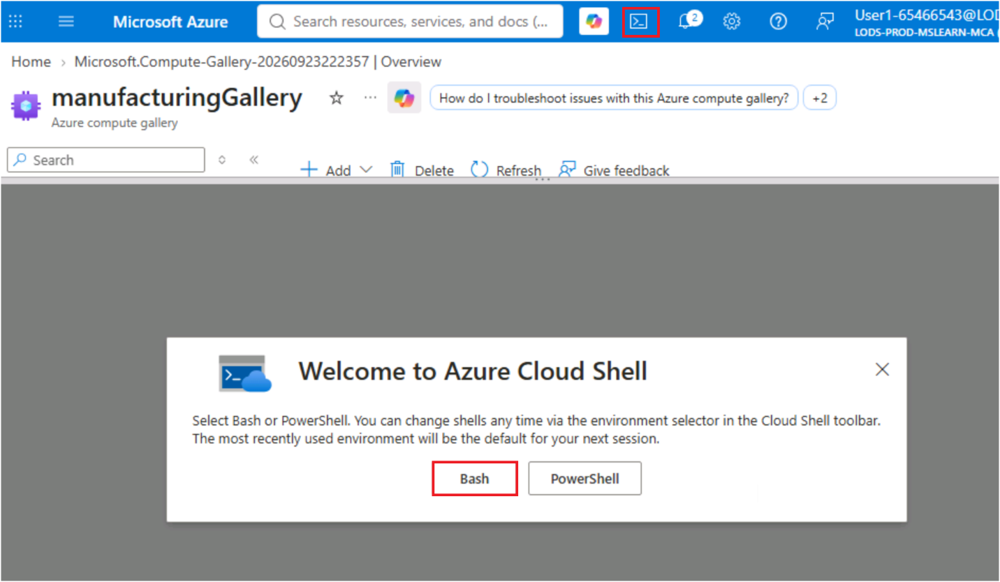

3.  Select subscription and then click on Apply.

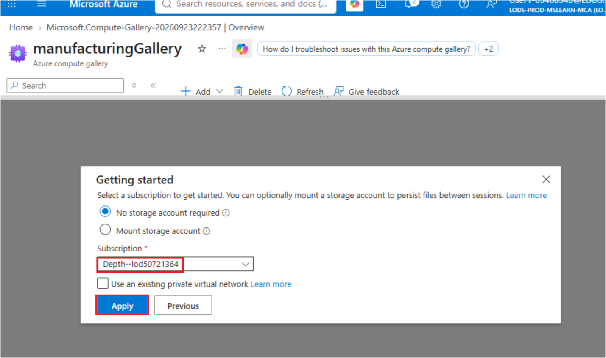

4.  Run below command set env varaibles

> \`\`\`
>
> export RESOURCE_GROUP="ResourceGroup1"
>
> export VM_NAME="govlinuxvm"
>
> \`\`\`

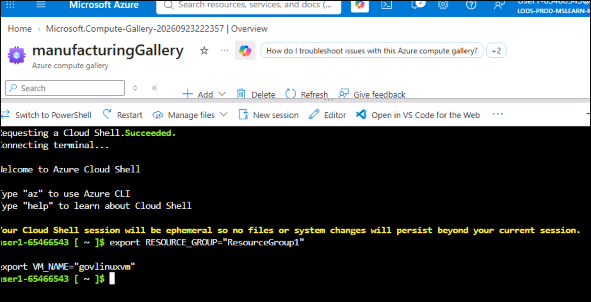

3\. Run below command to create Azure Linux VM

+++az vm create --resource-group $RESOURCE_GROUP --name $VM_NAME --image
microsoftazurelinux:azurelinux-4:4:latest --security-type Standard
--admin-username azureuser --generate-ssh-keys+++

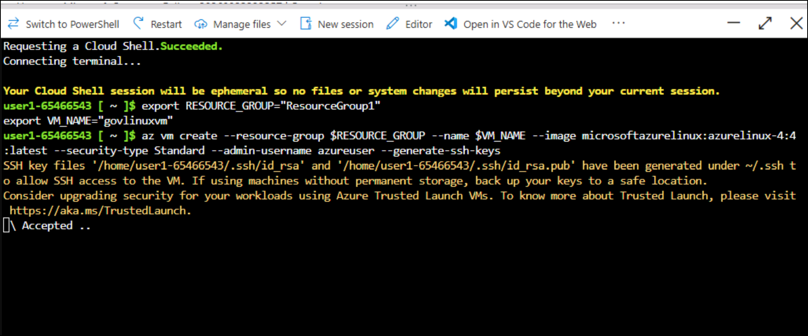

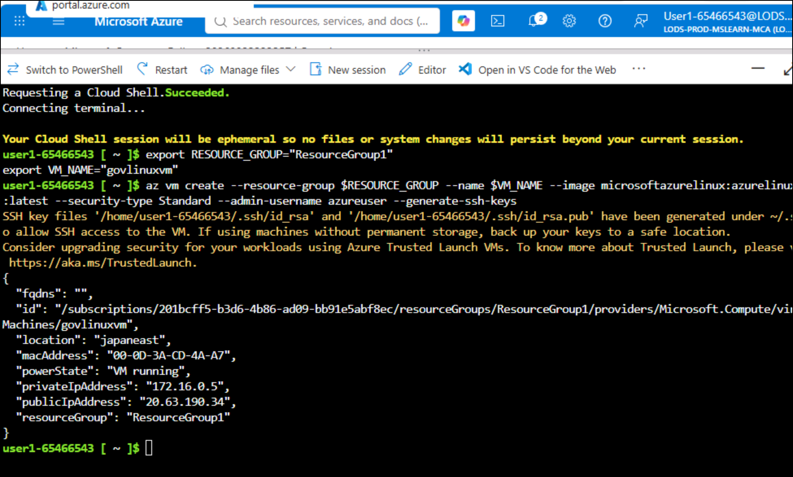

### Task 2: Assign a Required Tag Policy

Northwind Government Agency requires every resource to include a
department ownership tag.

1.  On Azure portal search, enter +++**Policy+++** and select it.

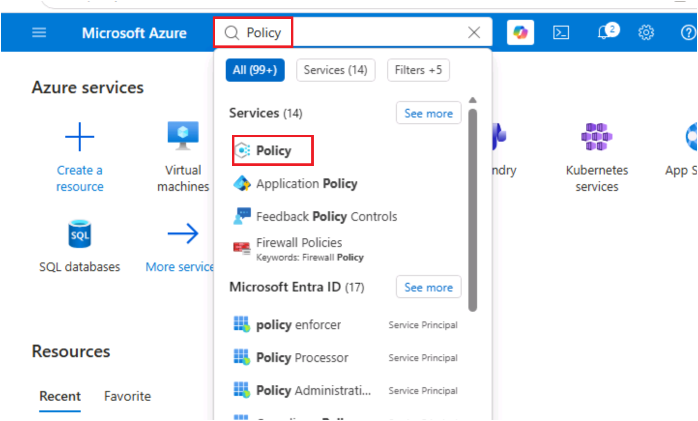

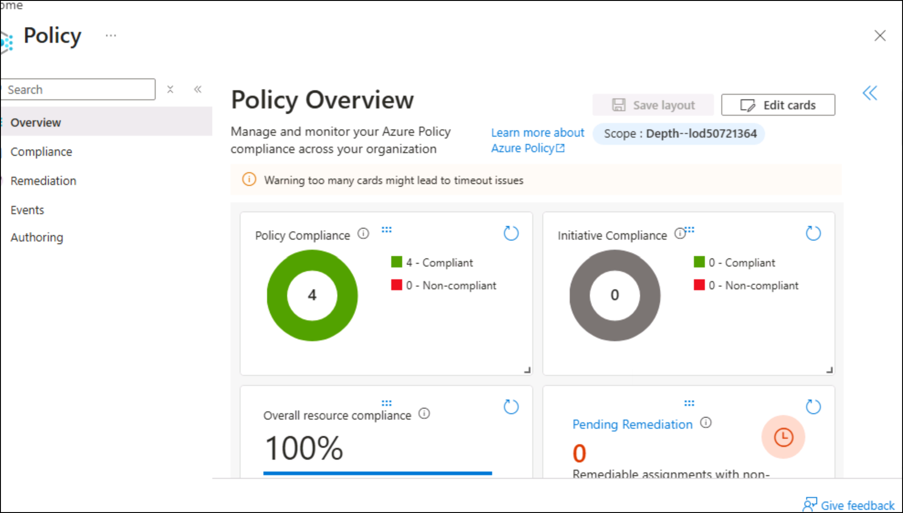

2\. Expand **Authoring -\> Definitions** . in the search bar enter
-+++**Require a tag on resources+++** and select it.

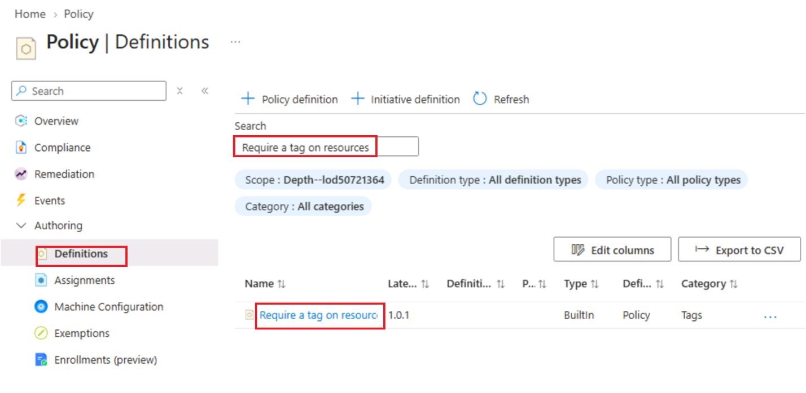

2.  Review the policy.

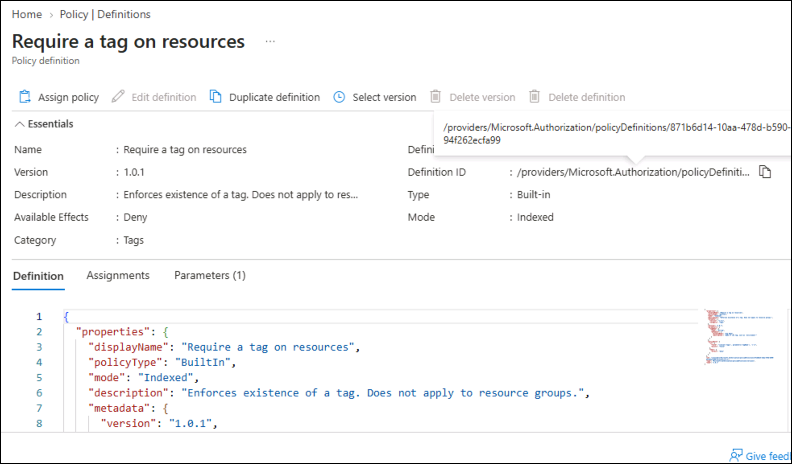

3.  Back to policy page and search for +++**Allowed locations+++** and
    open it.

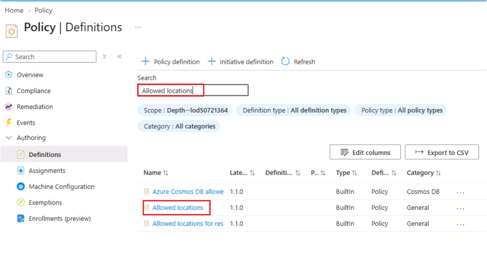

4.  Review purpose , parameters and policy effect.

> 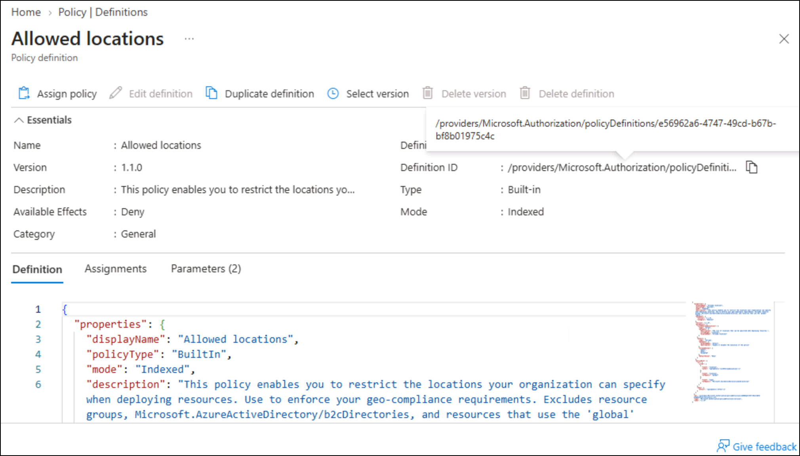

5.  Go back to Policy and review Compute governance policy. Search for
    +++**Allowed virtual machine size SKUs+++** and open and review it

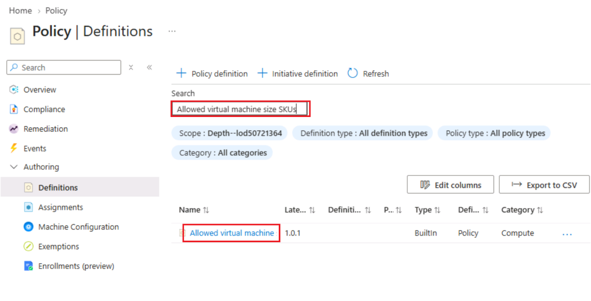

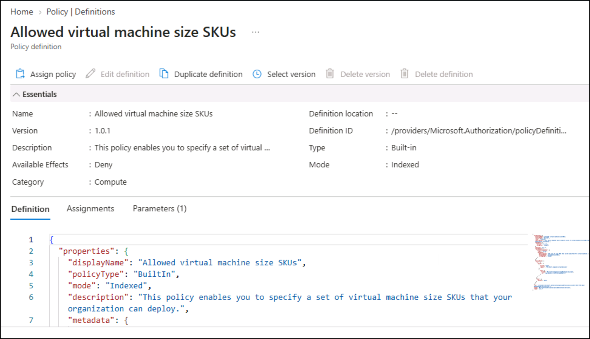

\> \[!note\]In a production Azure environment, administrators with
appropriate permissions such as **Owner**, **Contributor**, or
**Resource Policy Contributor** can assign Azure Policies to
subscriptions, management groups, and resource groups.

The training environment used in this lab doesn't grant the permission
required to create policy assignments
(Microsoft.Authorization/policyAssignments/write). Because of this
restriction, you will review Azure Policy definitions, assignments, and
compliance reports instead of creating new policy assignments.

The governance concepts, policy evaluation process, compliance
reporting, and remediation workflow remain the same regardless of how
policies are assigned.

## Exercise 2: Review existing policy Assignments and compliance reports

Policy assignments determine where a policy definition is applied.

Assignments are the mechanism used to enforce organizational governance
requirements.

1.  Go back to Policy page and select Assignments-. Open each assignment
    and review it.

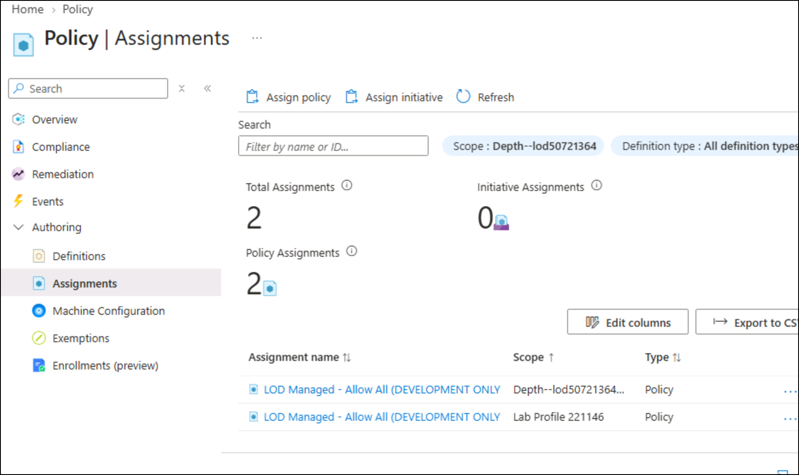

2.  Click on **Compliance** form left navigation menu.Open existing
    compliance and review them

> 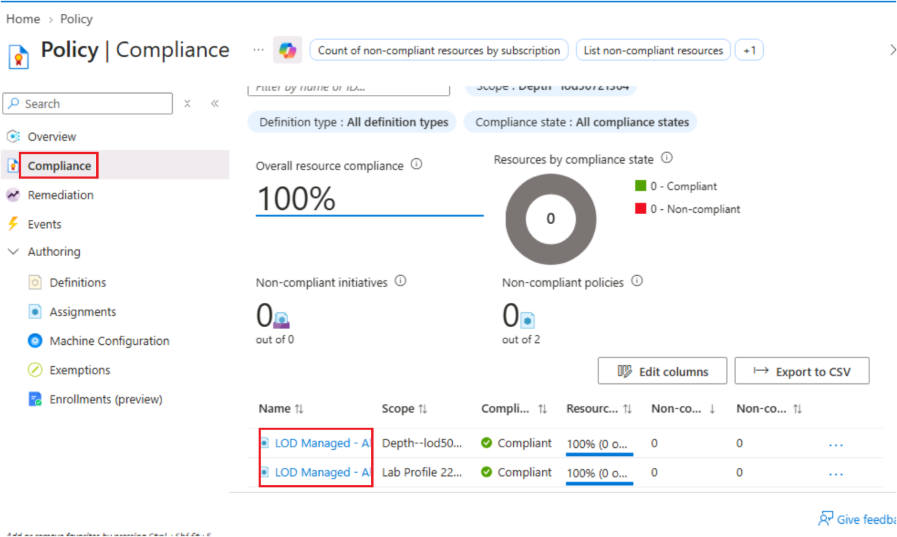

## Exercise 3: Implement Resource Governance

Tags help organizations identify resource ownership, track costs, and
support auditing activities.

1.  Open the virtual machine **govlinuxvm**

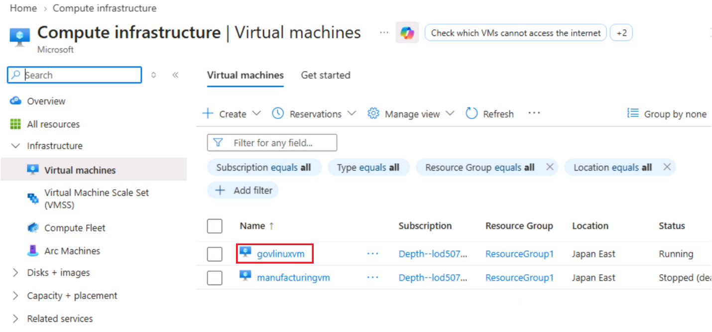

2.  On Overview page, click on **Add tags** under Tags field.

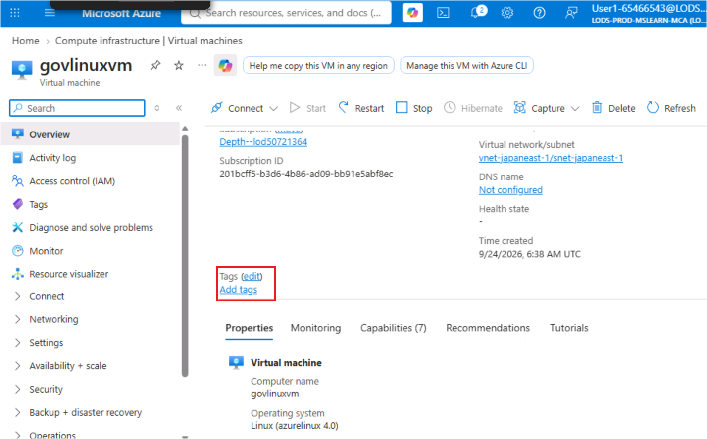

3.  Add the following tag and then click on **Save**.

Name: +++**Department+++**

Value: +++**CitizenServices+++**

> 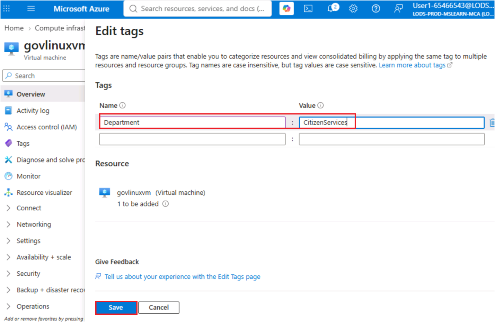

## Summary :

In this lab, you explored how **Azure Policy** supports governance and
compliance requirements for Azure Linux environments in a public sector
scenario. You deployed an Azure Linux virtual machine and reviewed
several built-in Azure Policy definitions, including policies used to
enforce resource tagging, restrict deployment locations, and control
approved virtual machine sizes. Due to permission restrictions in the
training environment, policy assignments could not be created; however,
you reviewed existing policy assignments and compliance reports to
understand how organizations implement and monitor governance controls.
You also applied a governance tag to the Azure Linux virtual machine to
simulate compliance with resource ownership requirements. By completing
this lab, you gained an understanding of Azure Policy concepts,
compliance evaluation, resource tagging strategies, and how governance
controls help public sector organizations maintain operational and
regulatory compliance across Azure resources.
